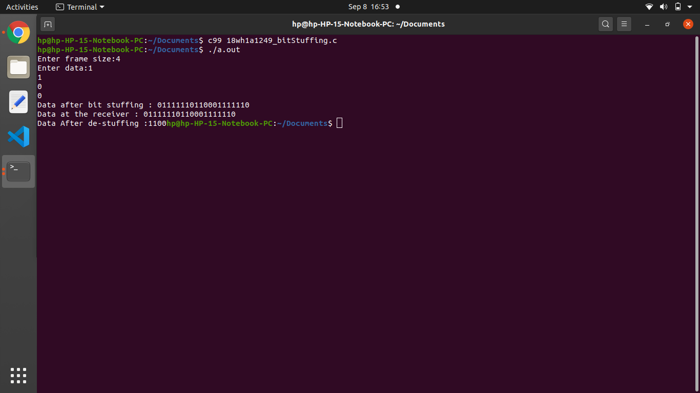

# Experiment 1

## Aim of the Experiment
To implement data link layer framing method Bit Stuffing.

## Steps :
1. Scan and store the input data.
2. Reserved characters 'DLESTR' and 'DLEETX' are added at the start and end of data respectively. 'DLESTR' indicates start of frame and 'DLEETX' indicates end of frame.
3. A extra 'DLE' is added if 'DLE' is encountered in the data.
4. Display data after character stuffing .
5. Display data at receivers end after de- stuffing.

## Output :

