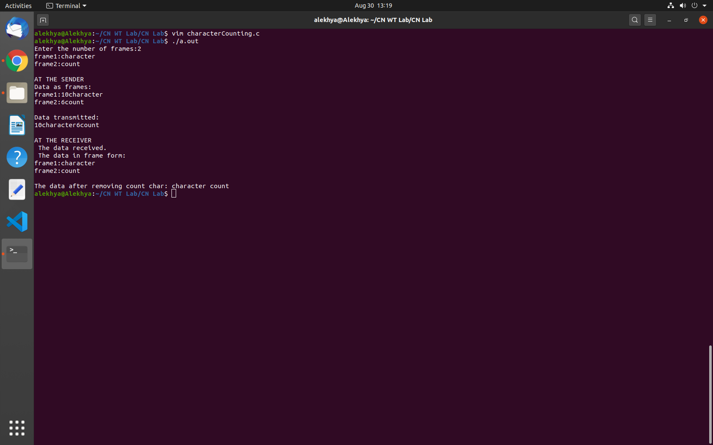

# Experiment 1

## Aim of the Experiment
To implement data link layer framing method character count.

## Steps :
1. Scan and store the number of frames.
2. Scan input data for each frame and store it in an array.
3. Display the data at the senders end that is frames size followed by frame data.
4. Display data at the receivers end in the frame form format.

## Output :

